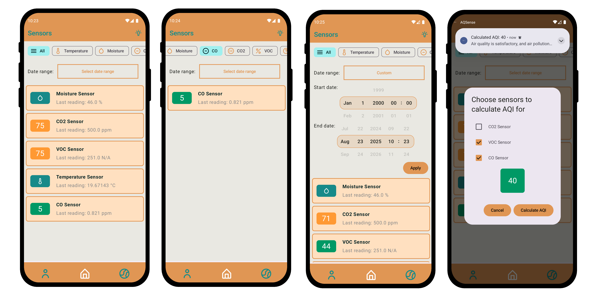
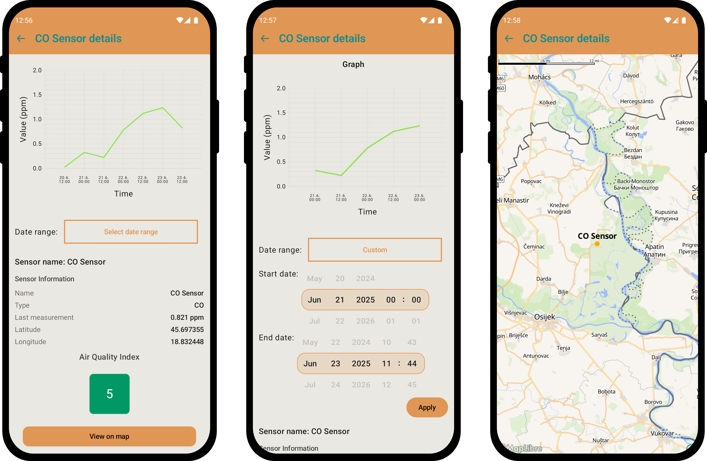
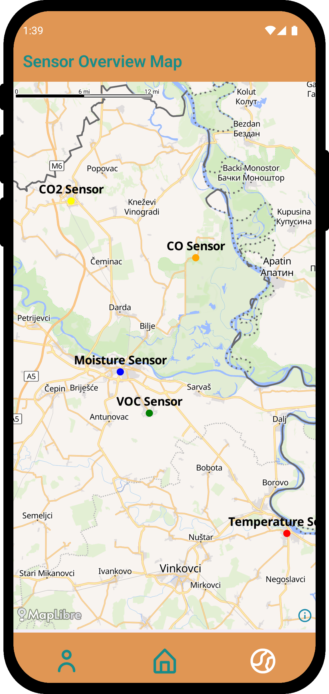

# AQSense

AQSense is a cross-platform mobile application that allows users to monitor air quality using their own sensors. It connects to a network of user-owned devices, providing real-time data visualization, geographic mapping, and intelligent notifications. Built with Kotlin Multiplatform and Compose Multiplatform, it delivers a native experience on both Android and iOS from a single codebase.

## App Preview

