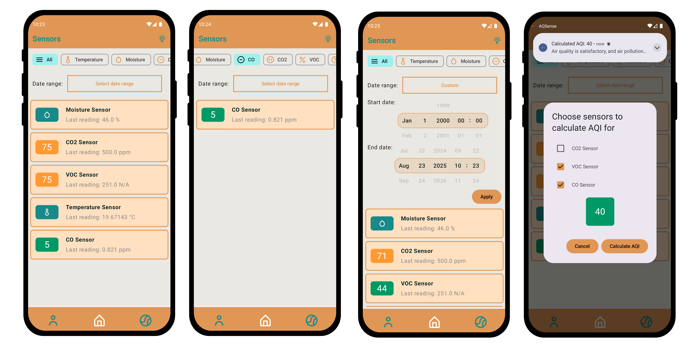
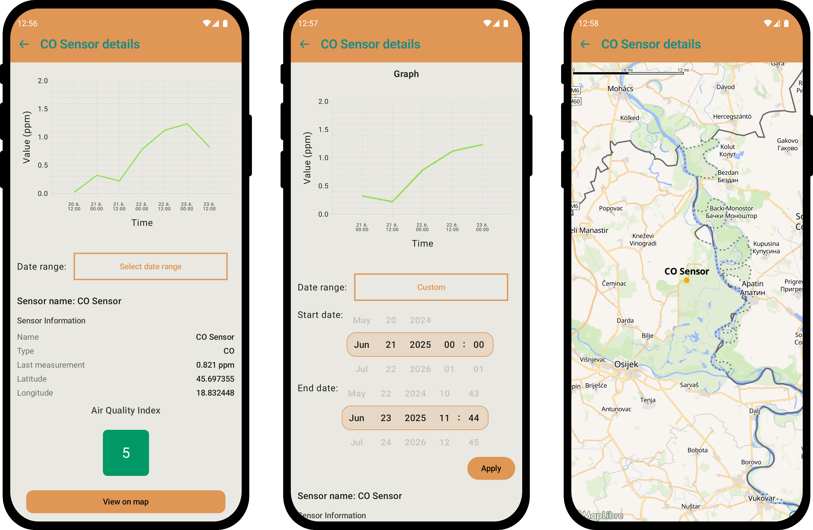
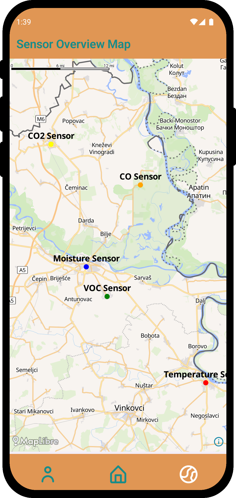

# AQSense

AQSense is a cross-platform mobile application that allows users to monitor air quality using their own sensors. It connects to a network of user-owned devices, providing real-time data visualization, geographic mapping, and intelligent notifications. Built with Kotlin Multiplatform and Compose Multiplatform, it delivers a native experience on both Android and iOS from a single codebase.

## 🛠️ Technologies Used

* **[Kotlin Multiplatform](https://kotlinlang.org/lp/multiplatform/)** – Shared business logic and models across Android and iOS.
* **[Compose Multiplatform](https://www.jetbrains.com/lp/compose-multiplatform/)** – UI development for both platforms with a unified codebase.
* **[Decompose](https://github.com/arkivanov/Decompose)** – Navigation and lifecycle management using a component-based architecture.
* **[Firebase Kotlin SDK (GitLive)](https://github.com/GitLiveApp/firebase-kotlin-sdk)** – Firebase integration (Cloud Firestore & Authentication) in Kotlin Multiplatform.
* **[KoalaPlot](https://github.com/KoalaPlot/koalaplot-core)** – Data visualization through interactive graphs and charts.
* **[KMP Notifier](https://github.com/mirzemehdi/KMPNotifier)** – Cross-platform local notifications.
* **[MapLibre Compose](https://github.com/maplibre/maplibre-compose)** – Open-source map rendering for geolocation and sensor mapping.

## App Preview

